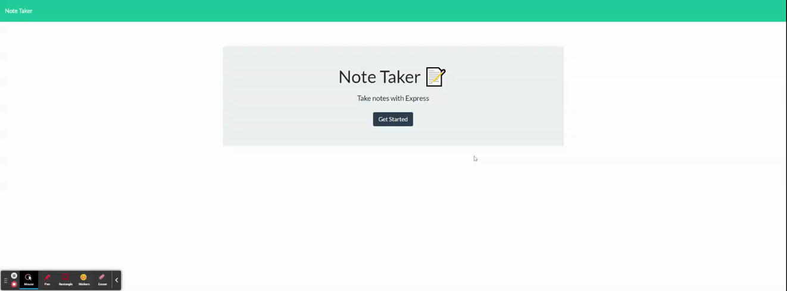

# 11 Express.js: Note Taker


## Links

[GitHub REPO](https://github.com/MiinoSil/11-NGO-EXPR-NOTE-TAKER-HWK-GIT)

[HEROKU GIT REPO](https://git.heroku.com/ngo-express-note-taker-app.git)

[HEROKU Hosted Page](https://ngo-express-note-taker-app.herokuapp.com/)


## Table of Contents
[Description](#description)
[User Story](#user-story)
[DEMO](#demo-of-working-app-on-heroku)
[NPM Requirements](#npm-requirements)
[Installation](#installation)
[Usage](#usage)
[Mock-up](#mock-up)
[Credits](#credits)
[License](#license)

## Description

This is note taking app deployed on HEROKU built utilizing Express.js. Starter code is provided for the front-end, the task is to connect the backend to the front-end. 

## User Story

```
AS A small business owner
I WANT to be able to write and save notes
SO THAT I can organize my thoughts and keep track of tasks I need to complete
```

## DEMO of working APP on HEROKU



[Screencastify Link to original video](https://drive.google.com/file/d/1PQ7JoafueL_u8p8MoS2DgU4qfKdpisrM/view)

## NPM Requirements
```
express.js
```
## Installation
```
npm install express
```
## Usage
```
npm start
```

Then use browser to access localhost or use insomnia.

## Mock-Up

The following images show the web application's appearance and functionality:


## Credits 
Made by Andrew Ngo

[GitHub Profile](https://github.com/MiinoSil)

## License 


Copyright (c) {{ 2022- }} {{ Andrew Ngo }}

Permission is hereby granted, free of charge, to any person obtaining a copy
of this software and associated documentation files (the "Software"), to deal
in the Software without restriction, including without limitation the rights
to use, copy, modify, merge, publish, distribute, sublicense, and/or sell
copies of the Software, and to permit persons to whom the Software is
furnished to do so, subject to the following conditions:

The above copyright notice and this permission notice shall be included in all
copies or substantial portions of the Software.

THE SOFTWARE IS PROVIDED "AS IS", WITHOUT WARRANTY OF ANY KIND,
EXPRESS OR IMPLIED, INCLUDING BUT NOT LIMITED TO THE WARRANTIES OF
MERCHANTABILITY, FITNESS FOR A PARTICULAR PURPOSE AND NONINFRINGEMENT.
IN NO EVENT SHALL THE AUTHORS OR COPYRIGHT HOLDERS BE LIABLE FOR ANY CLAIM,
DAMAGES OR OTHER LIABILITY, WHETHER IN AN ACTION OF CONTRACT, TORT OR
OTHERWISE, ARISING FROM, OUT OF OR IN CONNECTION WITH THE SOFTWARE OR THE USE
OR OTHER DEALINGS IN THE SOFTWARE.